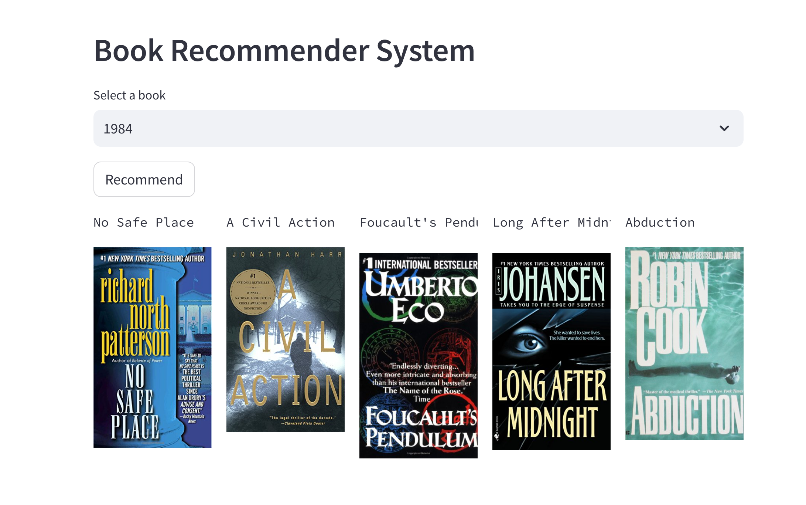
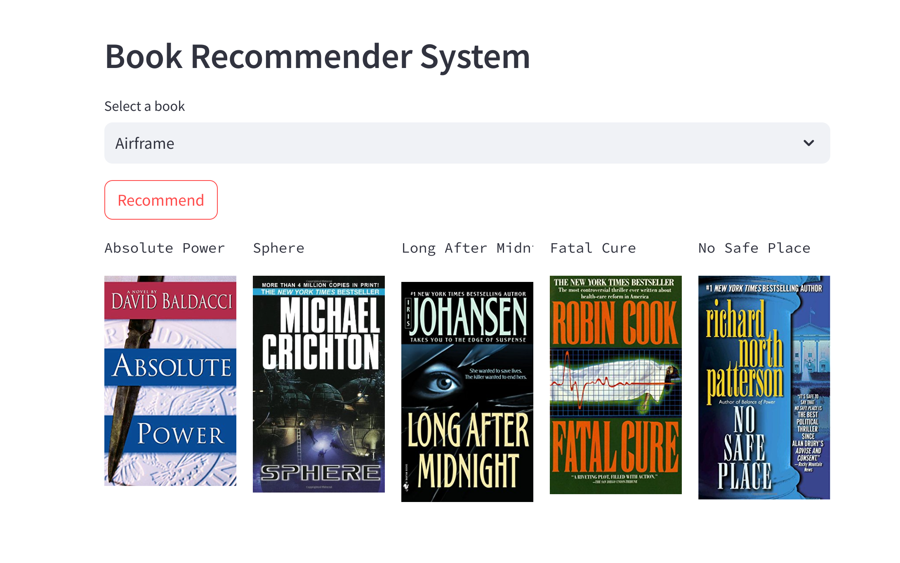

# BookRecommendationSystem

Recommendation systems are becoming increasingly important in today’s extremely busy world. People are always short on time with the myriad tasks they need to accomplish in the limited 24 hours. Therefore, the recommendation systems are important as they help them make the right choices, without having to expend their cognitive resources.

The purpose of a recommendation system basically is to search for content that would be interesting to an individual. Moreover, it involves a number of factors to create personalised lists of useful and interesting content specific to each user/individual. Recommendation systems are Artificial Intelligence based algorithms that skim through all possible options and create a customized list of items that are interesting and relevant to an individual. These results are based on their profile, search/browsing history, what other people with similar traits/demographics are watching, and how likely are you to watch those movies. This is achieved through predictive modeling and heuristics with the data available.

# Types of Recommendation System :

### 1 ) Content Based :

- Content-based systems, which use characteristic information and takes item attriubutes into consideration .

- Twitter , Youtube .

- Which music you are listening , what singer are you watching . Form embeddings for the features .
	
- User specific actions or similar items reccomendation .
	
- It will create a vector of it .
	
- These systems make recommendations using a user's item and profile features. They hypothesize that if a user was interested in an item in the past, they will once again be interested in it in the future
	
- One issue that arises is making obvious recommendations because of excessive specialization (user A is only interested in categories B, C, and D, and the system is not able to recommend items outside those categories, even though they could be interesting to them).

### 2 ) Collaborative Based :
		
- Collaborative filtering systems, which are based on user-item interactions.
	
- Clusters of users with same ratings , similar users .
	
- Book recommendation , so use cluster mechanism .
	
- We take only one parameter , ratings or comments .
	
- In short, collaborative filtering systems are based on the assumption that if a user likes item A and another user likes the same item A as well as another item, item B, the first user could also be interested in the second item . 
	
- Issues are :

	- User-Item nXn matrix , so computationally expensive .

	- Only famous items will get reccomended .

	- New items might not get reccomended at all .   

### 3 ) Hybrid Based :
	
- Hybrid systems, which combine both types of information with the aim of avoiding problems that are generated when working with just one kind.

- Combination of both and used now a days .

- Uses : word2vec , embedding .           

# About this project:

This is a streamlit web application that can recommend various kinds of similar books based on an user interest.

# Demo:







# Dataset has been used:

* [Dataset link](https://www.kaggle.com/datasets/arashnic/book-recommendation-dataset)

# Concept used to build the model.pkl file : NearestNeighbors

1 . Load the data
	
2 . Initialise the value of k

3 . For getting the predicted class, iterate from 1 to total number of training data points

4 . Calculate the distance between test data and each row of training data. Here we will use Euclidean distance as our distance metric since it’s the most popular method. 

5 . Sort the calculated distances in ascending order based on distance values
	
6 . Get top k rows from the sorted array

# How to run?
### STEPS:

Clone the repository

```bash
https://github.com/entbappy/Books-Recommender-System-Using-Machine-Learning
```
### STEP 01- Create a virtual environment after opening the repository

```bash
python3 -m venv .venv
```

```bash
source .venv/bin/activate
```


### STEP 02- install the requirements
```bash
pip install -r requirements.txt
```


```bash
#run this file to generate the models

Books Recommender.ipynb
```

Now run,
```bash
streamlit run app.py
```


